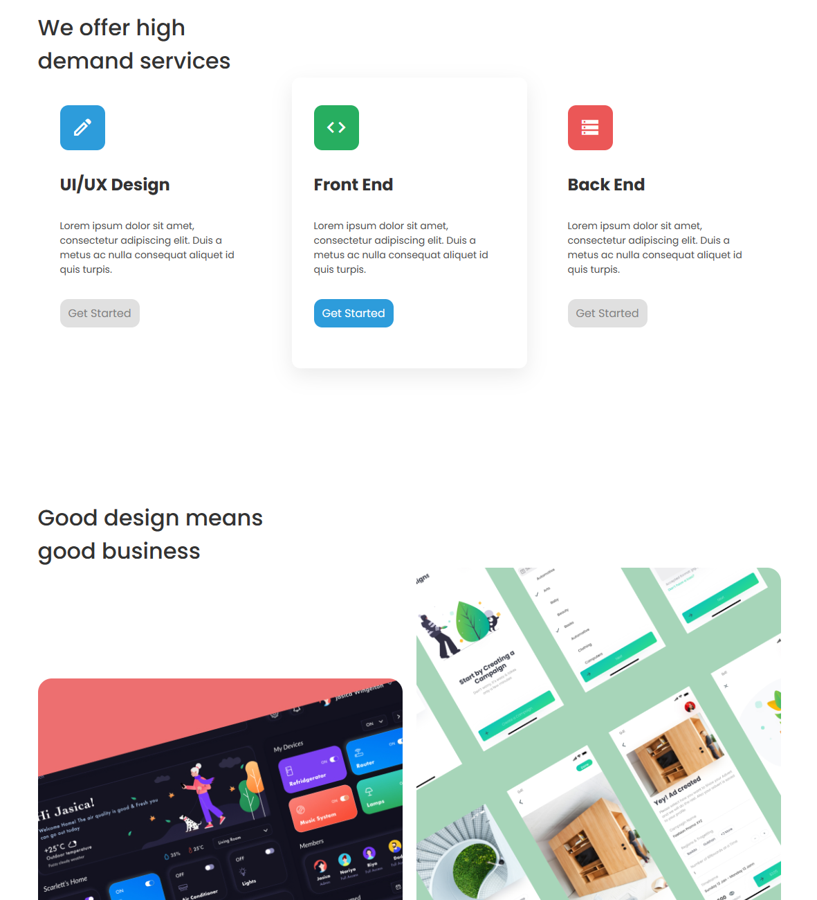
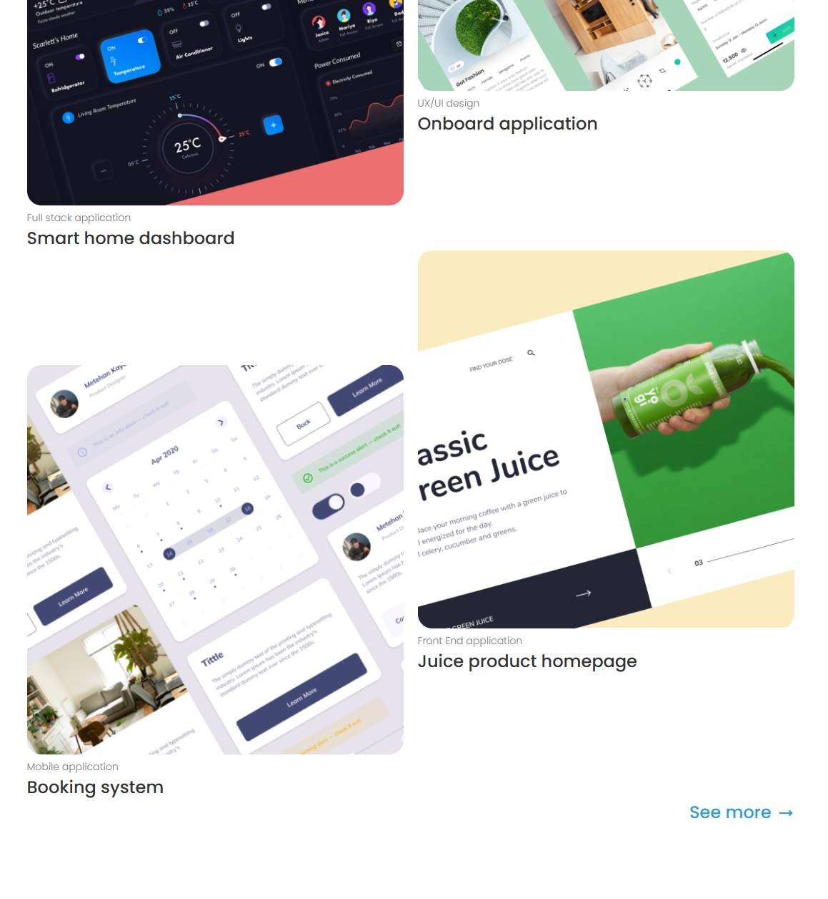
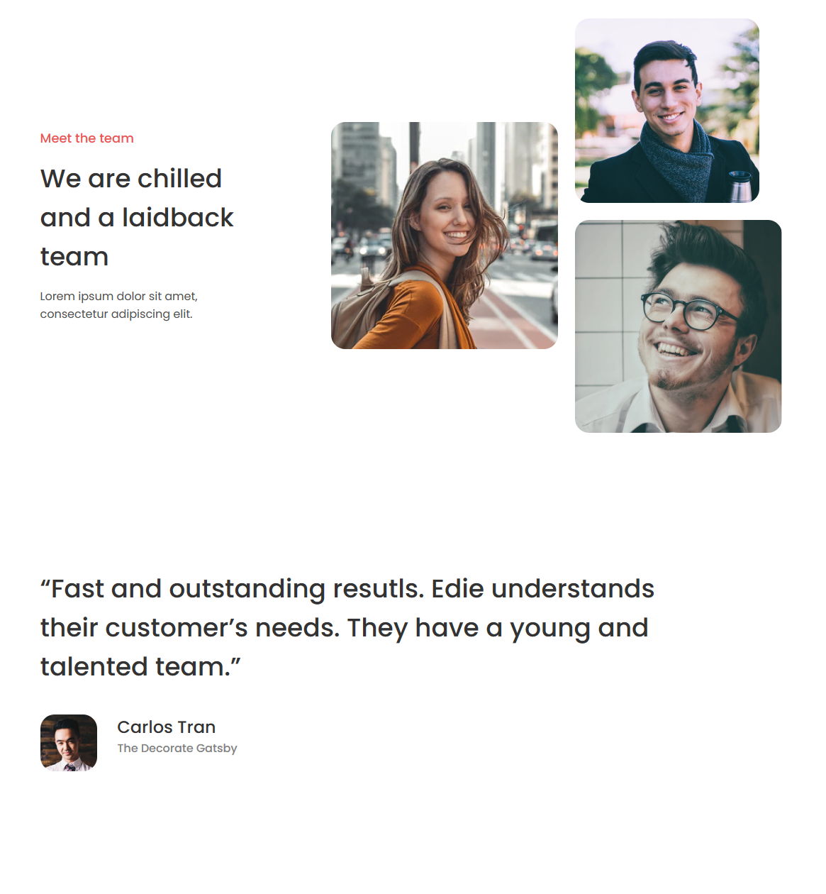
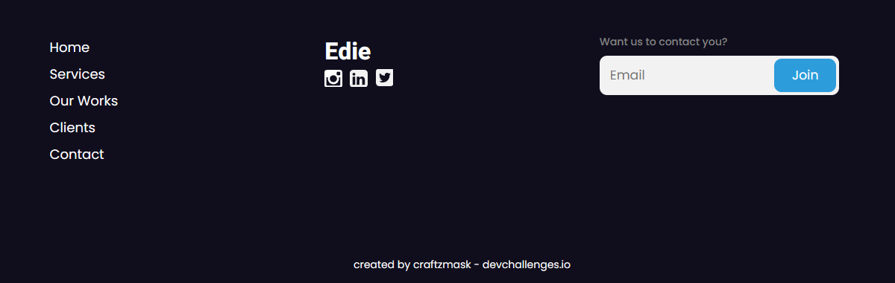
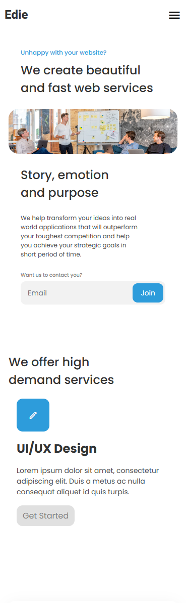
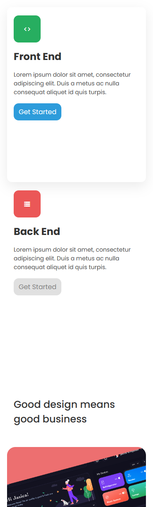
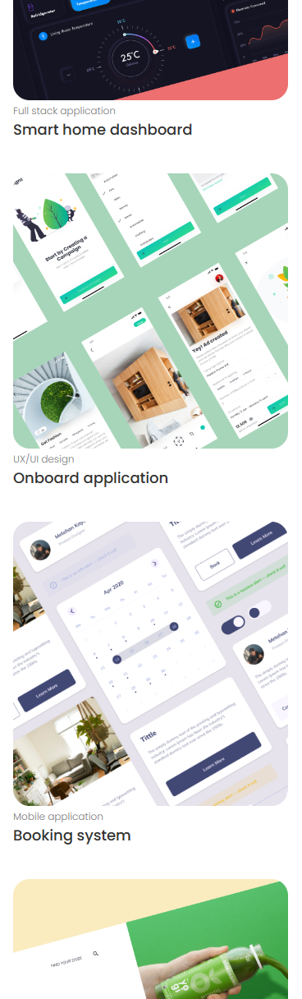
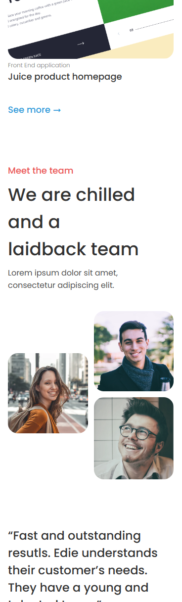
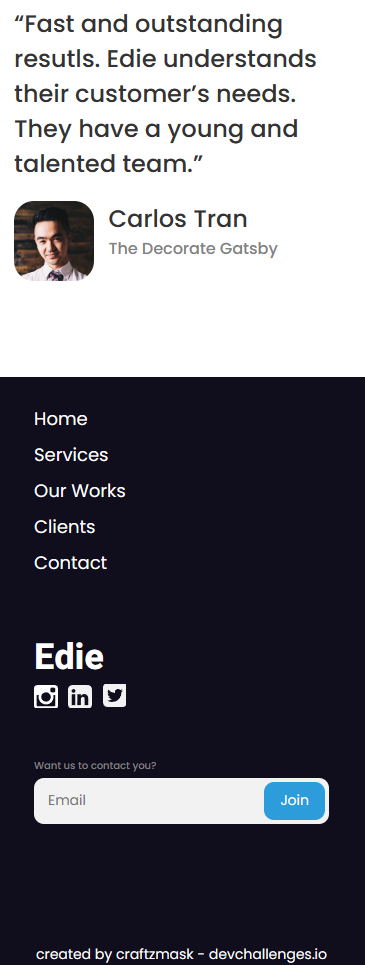

<!-- Please update value in the {}  -->

<h1 align="center">Edie homepage</h1>

<div align="center">
   Solution for a challenge from  <a href="http://devchallenges.io" target="_blank">Devchallenges.io</a>.
</div>

<div align="center">
  <h3>
    <a href="https://edie-homepage-7aa92.web.app/">
      Demo
    </a>
    <span> | </span>
    <a href="https://github.com/craftzmask/edie-homepage">
      Solution
    </a>
    <span> | </span>
    <a href="https://devchallenges.io/challenges/xobQBuf8zWWmiYMIAZe0">
      Challenge
    </a>
  </h3>
</div>

<!-- TABLE OF CONTENTS -->

## Table of Contents

- [Overview](#overview)
  - [Built With](#built-with)
- [Features](#features)
- [How to use](#how-to-use)
- [Contact](#contact)
- [Acknowledgements](#acknowledgements)

<!-- OVERVIEW -->

## Overview

#### Main Page






#### Mobile Page







Introduce your projects by taking a screenshot or a gif. Try to tell visitors a story about your project by answering:

- Where can I see your demo?
  - You can see it [here](https://edie-homepage-7aa92.web.app/)
- What was your experience?
  - I didn't organize css well, so it is a mess since this page is very long and contains many elements.
- What have you learned/improved?
  - Learned how to organize css better and different width's value
- Your wisdom? :)
  - 

### Built With

<!-- This section should list any major frameworks that you built your project using. Here are a few examples.-->

- HTML
- CSS
- JavaScript

## Features

<!-- List the features of your application or follow the template. Don't share the figma file here :) -->

This application/site was created as a submission to a [DevChallenges](https://devchallenges.io/challenges) challenge. The [challenge](https://devchallenges.io/challenges/xobQBuf8zWWmiYMIAZe0) was to build an application to complete the given user stories.

## How To Use

<!-- Example: -->

To clone and run this application, you'll need [Git](https://git-scm.com) and a browser such as [Google Chrome](https://www.google.com/chrome/) installed on your computer. From your command line:

```bash
# Clone this repository
$ git clone https://github.com/craftzmask/edie-homepage
```

## Acknowledgements

<!-- This section should list any articles or add-ons/plugins that helps you to complete the project. This is optional but it will help you in the future. For example -->

- [Responsive Navigation Bar Tutorial | HTML CSS JAVASCRIPT](https://www.youtube.com/watch?v=gXkqy0b4M5g&t=1164s&ab_channel=developedbyed)
- [A Complete Guide to Flexbox](https://css-tricks.com/snippets/css/a-guide-to-flexbox/)
- [A Complete Guide to CSS Grid](https://css-tricks.com/snippets/css/complete-guide-grid/)

## Contact

- GitHub [craftzmask](https://github.com/craftzmask/)
